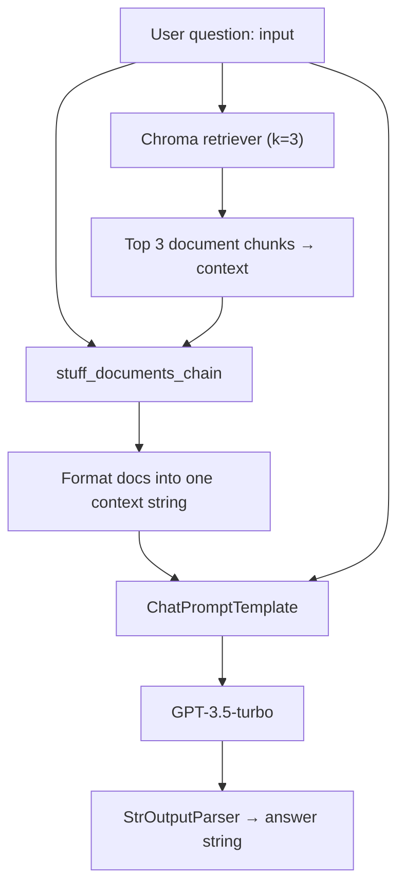

# RAG System with LangChain and ChromaDB

A Retrieval-Augmented Generation (RAG) project that loads text documents, stores embeddings in ChromaDB, and answers questions using OpenAI via LangChain.

## Features

- Load documents from a local `data/` directory
- Split text into chunks with `RecursiveCharacterTextSplitter`
- Store and retrieve embeddings with ChromaDB
- Build a RAG chain using `create_retrieval_chain` and `create_stuff_documents_chain`
- Query with similarity search and LLM-generated answers

## RAG Chain Architecture

When you invoke the RAG chain with a question, it follows this flow:



## Project Structure

```
.
├── chromadb.ipynb      # Main notebook (end-to-end RAG pipeline)
├── data/               # Sample text documents
├── requirements.txt    # Python dependencies
├── pyproject.toml      # uv/pip project config
└── .env.example        # Environment variable template
```

## Setup

### 1. Clone the repository

```bash
git clone https://github.com/niksom406/rag-system-with-langchain-and-chromadb.git
cd rag-system-with-langchain-and-chromadb
```

### 2. Create a virtual environment (uv)

```bash
uv venv
source .venv/bin/activate
uv pip install -r requirements.txt
```

Or with pip:

```bash
python -m venv .venv
source .venv/bin/activate
pip install -r requirements.txt
```

### 3. Configure environment variables

```bash
cp .env.example .env
```

Add your OpenAI API key to `.env`:

```
OPENAI_API_KEY=your_openai_api_key_here
```

### 4. Run the notebook

Open `chromadb.ipynb` in Jupyter or VS Code and select the `.venv` Python kernel.

## Usage

The notebook walks through:

1. Loading documents from `data/`
2. Chunking text for retrieval
3. Creating OpenAI embeddings
4. Persisting vectors in ChromaDB
5. Running similarity search
6. Building and invoking a RAG chain

Example query:

```python
result = rag_chain.invoke({"input": "What is Machine Learning?"})
print(result["answer"])
```

## Requirements

- Python 3.12+
- OpenAI API key

## License

MIT
