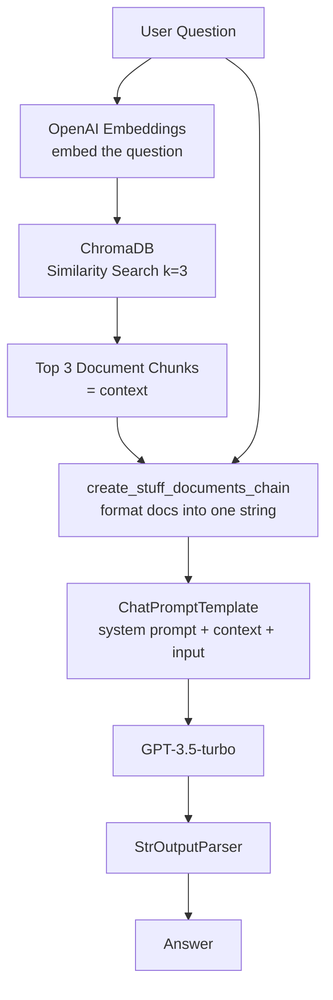
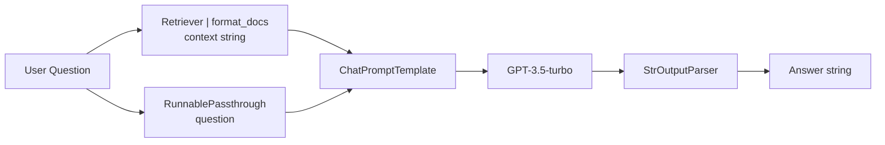
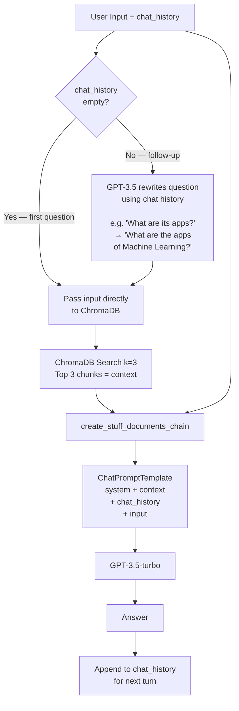

# RAG System with LangChain and ChromaDB

A Retrieval-Augmented Generation (RAG) project that loads text documents, stores embeddings in ChromaDB, and answers questions using OpenAI via LangChain. Includes both a standard RAG pipeline and an advanced conversational RAG pipeline with chat memory.

## Features

- Load documents from a local `data/` directory
- Split text into chunks with `RecursiveCharacterTextSplitter`
- Store and retrieve embeddings with ChromaDB
- Build a RAG chain using `create_retrieval_chain` and `create_stuff_documents_chain`
- Query with similarity search and LLM-generated answers
- **Advanced:** Conversational RAG with multi-turn chat memory using `create_history_aware_retriever`

---

## Pipeline 1: Standard RAG

A single-turn question-answering pipeline. Each question is answered independently from the vector store.



### Standard RAG — step by step

| Step | What happens |
|------|-------------|
| 1 | User question is embedded with OpenAI |
| 2 | ChromaDB finds the top 3 similar chunks |
| 3 | Chunks are stuffed into the prompt as `{context}` |
| 4 | GPT-3.5 answers using only that context |
| 5 | Plain text answer is returned |

**Usage:**
```python
result = rag_chain.invoke({"input": "What is Machine Learning?"})
print(result["answer"])
```

---

## Pipeline 2: LCEL RAG (LangChain Expression Language)

Same as Pipeline 1 but built with the `|` pipe operator for a more composable structure.



**Usage:**
```python
response = rag_chain_lcel.invoke("What is Machine Learning?")
print(response)
```

---

## Pipeline 3: Conversational RAG (with Chat Memory)

Multi-turn pipeline. Remembers previous messages so follow-up questions like *"What are its applications?"* are answered correctly by first rewriting the question using chat history.



### Conversational RAG — step by step

| Step | What happens |
|------|-------------|
| 1 | Check if `chat_history` is empty |
| 2a | **No history** → search Chroma with question as-is |
| 2b | **Has history** → LLM rewrites question into a standalone query |
| 3 | ChromaDB finds top 3 relevant chunks |
| 4 | Chunks + history + question sent to GPT-3.5 |
| 5 | Answer returned with `input`, `context`, and `answer` keys |

### Multi-turn example

```python
# Turn 1 — no history
result = ConversationChain.invoke({
    "input": "What is Machine Learning?",
    "chat_history": []
})
print(result["answer"])

# Turn 2 — "its" refers to ML from turn 1
result = ConversationChain.invoke({
    "input": "What are its common applications?",
    "chat_history": [
        HumanMessage(content="What is Machine Learning?"),
        AIMessage(content=result["answer"]),
    ]
})
print(result["answer"])
```

### How the LLM is used twice

```
Question rewriting (history_aware_retriever)
  chat_history + ambiguous question → standalone question

Answer generation (question_answer_chain)
  standalone question + retrieved context + history → final answer
```

---

## Project Structure

```
.
├── chromadb.ipynb      # Main notebook (end-to-end RAG pipeline)
├── data/               # Sample text documents (ML, Deep Learning, NLP)
├── requirements.txt    # Python dependencies
├── pyproject.toml      # uv/pip project config
└── .env.example        # Environment variable template
```

## Setup

### 1. Clone the repository

```bash
git clone https://github.com/niksom406/rag-system-with-langchain-and-chromadb.git
cd rag-system-with-langchain-and-chromadb
```

### 2. Create a virtual environment (uv)

```bash
uv venv
source .venv/bin/activate
uv pip install -r requirements.txt
```

Or with pip:

```bash
python -m venv .venv
source .venv/bin/activate
pip install -r requirements.txt
```

### 3. Configure environment variables

```bash
cp .env.example .env
```

Add your OpenAI API key to `.env`:

```
OPENAI_API_KEY=your_openai_api_key_here
```

### 4. Run the notebook

Open `chromadb.ipynb` in Jupyter or VS Code and select the `.venv` Python kernel.

## Notebook walkthrough

| Section | What it covers |
|---------|---------------|
| Setup | Load env, imports |
| Data | Sample ML/DL/NLP text, save to `data/` |
| Loading | `DirectoryLoader` reads `.txt` files |
| Splitting | `RecursiveCharacterTextSplitter` chunks docs |
| Embeddings | `OpenAIEmbeddings` + ChromaDB vector store |
| Retrieval | Similarity search with scores |
| Standard RAG | `create_retrieval_chain` + GPT-3.5 |
| LCEL RAG | Pipe-based chain with `RunnablePassthrough` |
| Add new docs | Add Reinforcement Learning doc to Chroma |
| Conversational RAG | `create_history_aware_retriever` + chat memory |

## Requirements

- Python 3.12+
- OpenAI API key

## License

MIT
